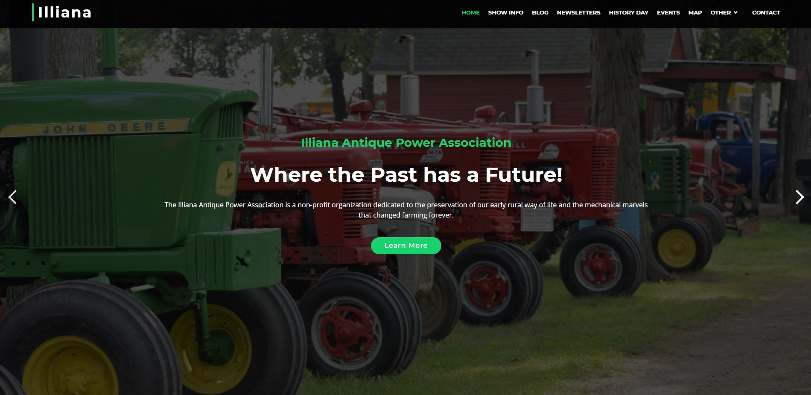

# Illiana Antique Power Association

Hey there! This repo has the code for the Illiana Antique Power Association's website, built with Angular.
It also contains all the newsletters that have been published, dating back to 2004. These can be found under `illiana-app/src/assets/newsletters`.

This site was originally built with an HTML5 template by BootstrapMade.
The template used a bunch of vanilla JavaScript and HTML files though, so I decided to port it to Angular to make things easier to manage.

If you'd like to run the app yourself, just follow the instructions in the README file under the `illiana-app` folder.
